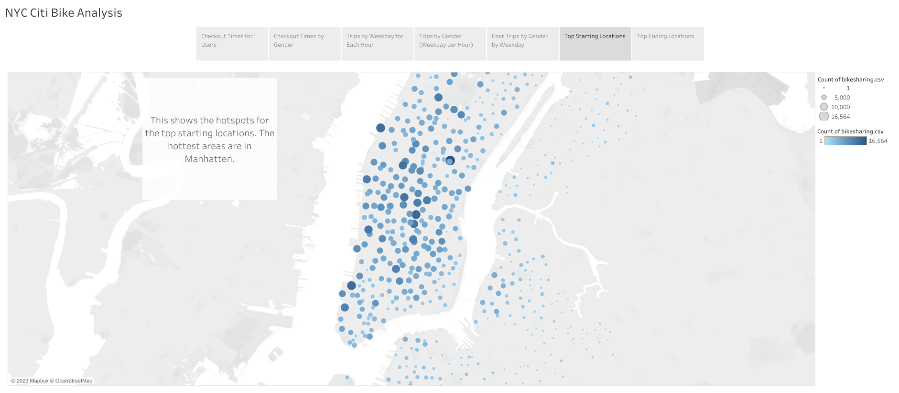
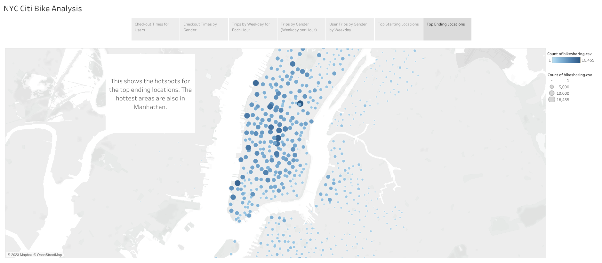
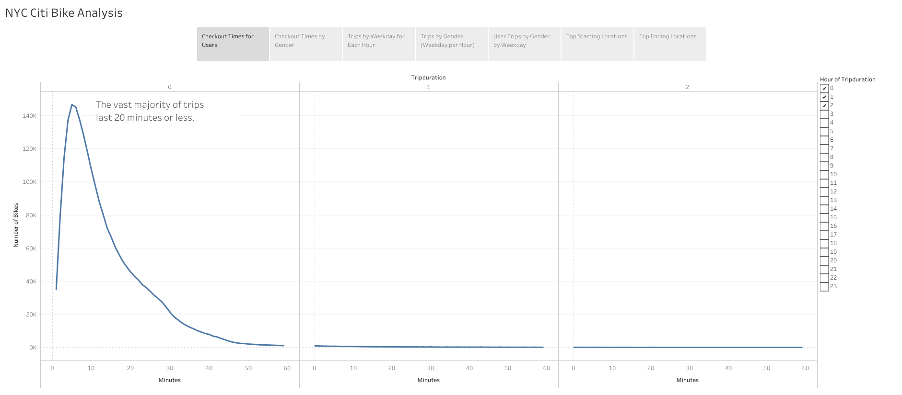
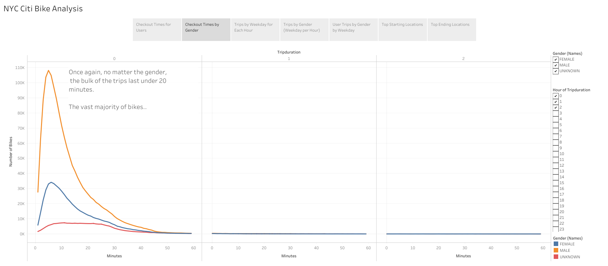
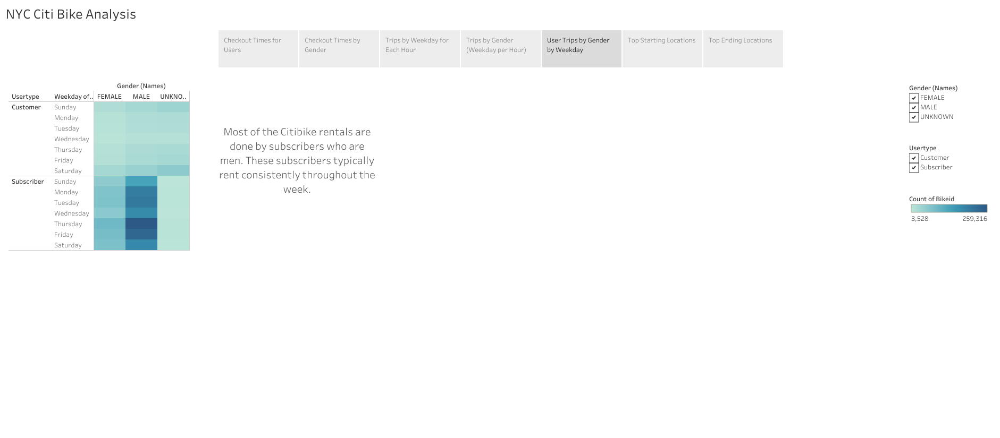
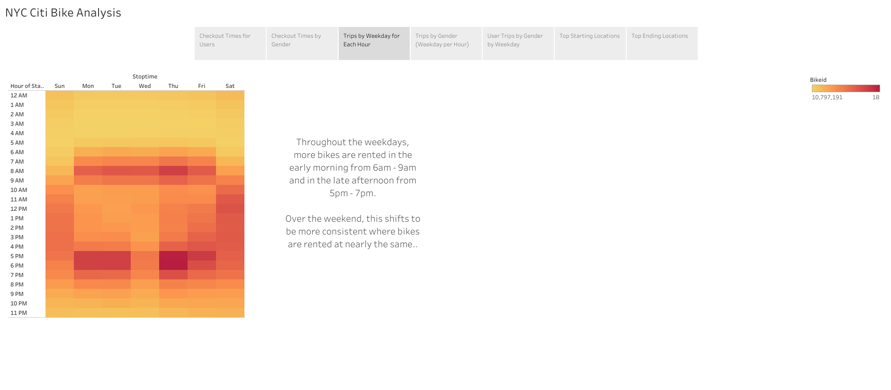
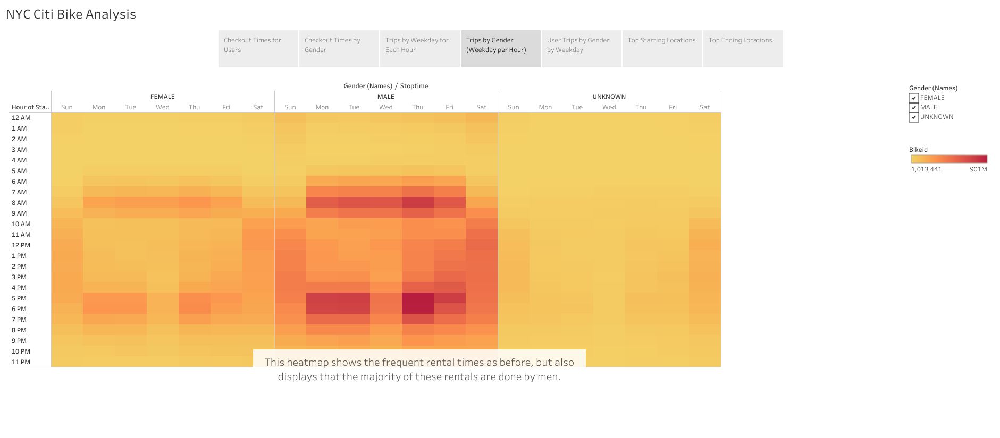

# CitiBike_Analysis

## Overview
Before planning to create a bikesharing company after a trip to New York, we must first analyze data gathered by a bikesharing company, CitiBike. Using this data, we can visualize factors that make a bikesharing company successful, and we can visualize trends in the data to focus our efforts correctly when starting the business.

## Results
Using Tableau, we analyzed the CitiBike data for Manhatten and we found many trends and visualized them. 
[Visit the Tableau CitiBike Story for this project.](https://public.tableau.com/app/profile/kaleb.gordon/viz/CitiBikeAnalysis_16777176213240/NYCCitiBikeAnalysis?publish=yes "NYC CitiBike Analysis")

The descriptions of each visualization can be seen in the image. 

 

## Summary
Among the many factors and trends we were able to analyze, the most prominent would be the location of the rentals, the gender of the individual renting the bike, and the day of the week. 

In our data, the primary locations for renting are busy city environments that have a lot of traffic and tourism. We also see that males heavily outweigh females or non-binary individuals in bike rentals. For subscribers who use the bikes daily, we can see that they consistently use the rentals throughout the work week. For non-subscribers, they prefer the weekends. Bikes are typically rented early in the morning or later in the evening during the work week, while the bike rentals during the weekend are fairly consistent throughout the day. 

In conclusion, using Tableau, we were able to find many trends and factors to focus on when creating our bikesharing company. I am sure that with this data we can have a head start in helping our customers with their commute. 
